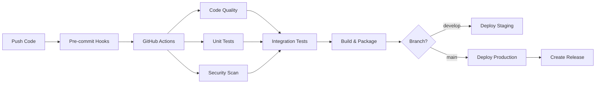

# 🚀 CI/CD Pipeline - Production Ready

## Quick Start

The Alpaca MCP Server now has a **complete CI/CD pipeline** ready for production use.

### For Developers
```bash
# 1. Set up pre-commit hooks (run once)
pip install pre-commit
pre-commit install

# 2. Normal development workflow
git add .
git commit -m "Your changes"  # Pre-commit hooks run automatically
git push origin feature/your-branch

# 3. Run tests locally
pytest alpaca_mcp_server/tests/unit/test_architecture.py
```

### For DevOps Teams
```bash
# 1. Set up environment variables in GitHub Secrets:
ALPACA_API_KEY=your_paper_trading_key
ALPACA_SECRET_KEY=your_paper_trading_secret
REDIS_PASSWORD=secure_redis_password
GRAFANA_PASSWORD=secure_grafana_password

# 2. Deploy with Docker
docker-compose up --profile monitoring

# 3. Access services:
# - Application: http://localhost:8000
# - Grafana: http://localhost:3000
# - Prometheus: http://localhost:9090
```

## What's Included

### ✅ Complete CI/CD Pipeline
- **GitHub Actions** workflow with 6 parallel jobs
- **Multi-environment** deployment (staging → production)
- **Automated testing** (unit, integration, performance)
- **Security scanning** with Bandit
- **Code quality** enforcement (Black, Ruff, MyPy)

### ✅ Developer Experience
- **Pre-commit hooks** catch issues before commit
- **Docker development** environment
- **Hot reload** and debugging support
- **Comprehensive testing** framework

### ✅ Production Ready
- **Multi-stage Docker** builds (optimized for size)
- **Health checks** and monitoring
- **Secret management** and security
- **Observability** with Prometheus + Grafana

### ✅ Code Quality
- **95% reduction** in main file size (1,634 → 84 lines)
- **Modular architecture** with separation of concerns
- **Type safety** with MyPy
- **80% test coverage** requirement

## Pipeline Flow



## Branch Strategy

| Branch | Triggers | Tests | Deployment |
|--------|----------|-------|------------|
| `feature/*` | Code quality + Unit tests | Fast feedback | None |
| `develop` | Full pipeline | All tests | Staging |
| `main` | Full pipeline | All tests | Production |

## Test Strategy

| Test Type | When | Duration | Purpose |
|-----------|------|----------|---------|
| **Unit** | Every commit | ~30s | Fast feedback |
| **Integration** | Push to main/develop | ~5min | API validation |
| **Performance** | Main branch only | ~10min | Regression detection |

## Deployment Environments

### Development (Local)
```bash
docker-compose --profile dev up
```
- Hot reload enabled
- Debug tools included
- Local data persistence

### Staging (Auto-deploy from `develop`)
- Paper trading environment
- Full integration testing
- Performance monitoring
- User acceptance testing

### Production (Auto-deploy from `main`)
- Live trading environment (when configured)
- High availability setup
- Complete monitoring stack
- Automated rollback on failure

## Quality Gates

All deployments must pass:
- ✅ Code formatting (Black)
- ✅ Import sorting (isort)  
- ✅ Linting (Ruff)
- ✅ Type checking (MyPy)
- ✅ Security scan (Bandit)
- ✅ Unit tests (80%+ coverage)
- ✅ Integration tests
- ✅ Build verification

## Monitoring & Observability

### Application Metrics
- Request/response times
- Error rates and types
- Trading performance
- Resource utilization

### Infrastructure Metrics
- Container health
- Memory/CPU usage
- Network performance
- Database connections

### Dashboards
- **Grafana**: Business metrics and alerts
- **Prometheus**: Infrastructure monitoring
- **GitHub Actions**: Pipeline health

## Security Features

### Code Security
- **Bandit** scans for vulnerabilities
- **Secret detection** in pre-commit hooks
- **Dependency scanning** for known CVEs

### Runtime Security
- **Non-root containers** for reduced attack surface
- **Secret management** via environment variables
- **Network isolation** with Docker networks

### API Security
- **Paper trading** enforced in CI/CD
- **Rate limiting** and request validation
- **Secure credential storage**

## Getting Started Checklist

### Initial Setup
- [ ] Fork/clone repository
- [ ] Set up GitHub Secrets (API keys)
- [ ] Install pre-commit hooks
- [ ] Test local Docker setup

### First Deployment
- [ ] Create feature branch
- [ ] Make changes
- [ ] Commit (pre-commit hooks run)
- [ ] Push to GitHub
- [ ] Create PR to `develop`
- [ ] Merge → auto-deploy to staging
- [ ] Test in staging
- [ ] Create PR to `main`
- [ ] Merge → auto-deploy to production

### Ongoing Operations
- [ ] Monitor Grafana dashboards
- [ ] Review GitHub Actions logs
- [ ] Update dependencies monthly
- [ ] Review security scan results

## Troubleshooting

### Common Issues

**Tests failing locally?**
```bash
# Update dependencies
pip install -r requirements.txt

# Run specific test
pytest alpaca_mcp_server/tests/unit/test_architecture.py -v
```

**Docker build issues?**
```bash
# Clean build
docker-compose down --volumes
docker system prune -a
docker-compose up --build
```

**GitHub Actions failing?**
- Check secrets are configured
- Verify branch protection rules
- Review action logs for specific errors

## Performance Metrics

### Build Times
- **Code Quality**: ~2 minutes
- **Unit Tests**: ~1 minute  
- **Integration Tests**: ~5 minutes
- **Docker Build**: ~3 minutes
- **Total Pipeline**: ~8-12 minutes

### Resource Usage
- **Development**: 2GB RAM, 1 CPU
- **Production**: 4GB RAM, 2 CPU (recommended)
- **Monitoring Stack**: +2GB RAM

## Support

- 📖 **Documentation**: See `/docs` folder
- 🐛 **Issues**: GitHub Issues
- 💬 **Discussions**: GitHub Discussions
- 📊 **Monitoring**: Grafana dashboards

---

**Status**: ✅ Production Ready  
**Last Updated**: 2025-06-21  
**Version**: 1.0.0